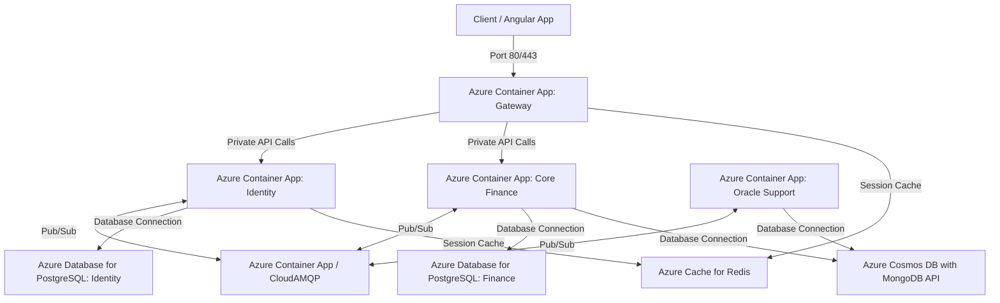

# Panduan Deploy Proyek E.O.P ke Microsoft Azure Menggunakan Docker

Dokumen ini berisi panduan langkah-demi-langkah untuk mendeploy proyek **E.O.P (Eyes Of Priestess)** ke Microsoft Azure dalam bentuk kontainer Docker. 

Berdasarkan arsitektur microservices dan multi-database (PostgreSQL, MongoDB, Redis, RabbitMQ) proyek ini, terdapat dua opsi deployment utama yang dapat Anda pilih sesuai dengan kebutuhan (tujuan pengujian/UAS vs. produksi).

---

## 📌 Ringkasan Pilihan Arsitektur Deployment

| Parameter | Opsi 1: Azure VM + Docker Compose (Rekomendasi UAS) | Opsi 2: Azure Container Apps + Managed Services (Standar Industri) |
| :--- | :--- | :--- |
| **Tingkat Kesulitan** | 🟢 Sangat Mudah & Cepat | 🟡 Sedang hingga Tinggi |
| **Estimasi Biaya** | 💸 Sangat Murah (Free Tier / B1s - B2s VM) | 💳 Sedang hingga Mahal |
| **Kecocokan** | Kebutuhan demo UAS, testing, & portabilitas cepat | Aplikasi produksi yang butuh auto-scaling & high availability |
| **Keamanan Data** | Server lokal di VM (resiko data loss jika VM dihapus tanpa volume backup) | Terjamin oleh database cloud terkelola (PaaS) |
| **Kemudahan Pemeliharaan** | Menggunakan 1 file `docker-compose.yml` yang sama seperti lokal | Menggunakan Azure Container Registry (ACR) & Container Apps |

---

## 🛠️ Opsi 1: Deploy Menggunakan Azure VM + Docker Compose (Rekomendasi UAS)

Pendekatan ini adalah cara tercepat untuk memindahkan aplikasi yang sudah berjalan lancar di komputer lokal Anda ke cloud Azure tanpa mengubah konfigurasi internal apa pun.

### Langkah 1: Membuat Virtual Machine (Ubuntu Server) di Azure Portal
1. Masuk ke [Azure Portal](https://portal.azure.com/).
2. Cari dan pilih **Virtual Machines** -> klik **Create** -> **Azure Virtual Machine**.
3. Konfigurasi VM:
   * **Project details:** Pilih Subscription dan Resource Group Anda.
   * **Virtual machine name:** `eop-production-vm`
   * **Region:** Pilih region terdekat (misalnya: *Southeast Asia*).
   * **Image:** **Ubuntu Server 22.04 LTS - x64 Gen2** (sangat stabil untuk Docker).
   * **Size:** Minimal **Standard_B2s** (2 vCPUs, 4 GiB memory) agar kuat menjalankan 10 kontainer secara bersamaan.
   * **Administrator account:** Pilih **SSH public key** (masukkan public key laptop Anda) atau **Password** demi kemudahan akses.
4. Di bagian **Inbound port rules**:
   * Pilih **Allow selected ports** dan centang **SSH (22)** dan **HTTP (80)**.

### Langkah 2: Mengonfigurasi Network Security Group (NSG) Azure
Agar client dapat mengakses frontend dan backend gateway dari luar, Anda harus membuka port yang dibutuhkan di Azure Network Security:
1. Setelah VM terbuat, masuk ke resource VM tersebut.
2. Pada menu kiri, pilih **Settings** -> **Networking**.
3. Klik **Add inbound port rule**:
   * **Destination port ranges:** `80` (untuk Angular Frontend)
   * **Protocol:** `TCP`
   * **Action:** `Allow`
   * **Priority:** `1000`
   * **Name:** `Allow_HTTP_All`
4. *(Opsional)* Jika Angular diakses melalui HTTPS di kemudian hari, tambahkan rule untuk port `443`.
5. *(Opsional)* Jika Anda ingin menembak Gateway API secara langsung dari luar tanpa melalui Frontend container, buka port `8080` (tetapi demi keamanan, biarkan tertutup dan arahkan semua trafik luar hanya ke port `80`).

### Langkah 3: Koneksi ke VM & Instalasi Docker + Docker Compose
Gunakan terminal laptop Anda (PowerShell/CMD di Windows) untuk masuk ke VM:

```bash
ssh <username>@<IP_Public_Azure_VM>
```

Setelah berhasil masuk ke dalam shell Ubuntu VM, jalankan skrip berikut untuk menginstal Docker & Docker Compose:

```bash
# Update package list
sudo apt-get update -y

# Install prerequisite packages
sudo apt-get install -y apt-transport-https ca-certificates curl software-properties-common

# Add Docker's official GPG key
curl -fsSL https://download.docker.com/linux/ubuntu/gpg | sudo gpg --dearmor -o /usr/share/keyrings/docker-archive-keyring.gpg

# Set up the stable repository
echo "deb [arch=$(dpkg --print-architecture) signed-by=/usr/share/keyrings/docker-archive-keyring.gpg] https://download.docker.com/linux/ubuntu $(lsb_release -cs) stable" | sudo tee /etc/apt/sources.list.d/docker.list > /dev/null

# Install Docker Engine
sudo apt-get update -y
sudo apt-get install -y docker-ce docker-ce-cli containerd.io

# Install Docker Compose V2
sudo apt-get install -y docker-compose-plugin

# Masukkan user saat ini ke group docker agar tidak perlu mengetik 'sudo' setiap kali menjalankan perintah docker
sudo usermod -aG docker $USER
```
> [!IMPORTANT]
> Setelah menjalankan perintah `usermod`, Anda harus keluar dari SSH (`exit`) and masuk kembali (`ssh ...`) agar perubahan grup pengguna aktif.

Verifikasi instalasi dengan perintah:
```bash
docker --version
docker compose version
```

### Langkah 4: Transfer File Proyek & Menjalankan Stack
1. Di dalam VM, clone repository proyek UAS Anda dari GitHub:
   ```bash
   git clone https://github.com/<username_github>/<nama_repo_uas>.git eop-project
   cd eop-project
   ```
2. Buat file `.env` berdasarkan template `.env.example` yang sudah ada:
   ```bash
   cp .env.example .env
   nano .env
   ```
   *Sesuaikan variabel seperti `POSTGRES_USER`, `POSTGRES_PASSWORD`, `JWT_SECRET`, `GEMINI_API_KEY`, dan kredensial email.*

3. Jalankan aplikasi menggunakan Docker Compose:
   ```bash
   docker compose up --build -d
   ```

4. Periksa apakah semua kontainer berjalan lancar:
   ```bash
   docker compose ps
   ```
   Aplikasi Anda kini sudah dapat diakses di browser melalui IP Publik Azure VM Anda: `http://<IP_Public_Azure_VM>`.

---

## ☁️ Opsi 2: Deploy Menggunakan Azure Container Apps + Managed Services (Skala Produksi)

Dalam arsitektur mikro/skala besar, menyimpan database (Postgres, MongoDB, Redis) di dalam kontainer di satu VM sangat berisiko. Opsi ini memisahkan **Stateless Applications** (Backend & Frontend) ke **Azure Container Apps (ACA)**, dan **Stateful Infrastructure** ke layanan PaaS terkelola Azure.



### Langkah 1: Buat Azure Container Registry (ACR) & Push Docker Images
Azure Container Apps memerlukan gambar (images) Docker yang tersimpan di repositori online. Kita akan menggunakan ACR.

1. Buat ACR di Azure Portal (misal namanya: `eopregistry.azurecr.io`).
2. Aktifkan **Admin user** di pengaturan Access Keys ACR Anda agar mendapat username dan password login.
3. Login to ACR dari komputer lokal Anda:
   ```bash
   docker login eopregistry.azurecr.io
   ```
4. Build, tag, dan push setiap service kustom Anda:
   ```bash
   # Contoh untuk service identity
   docker build -t eopregistry.azurecr.io/eop-identity:latest ./identity
   docker push eopregistry.azurecr.io/eop-identity:latest

   # Ulangi langkah di atas untuk core, oracle, gateway, dan frontend
   docker build -t eopregistry.azurecr.io/eop-core:latest ./core
   docker push eopregistry.azurecr.io/eop-core:latest

   docker build -t eopregistry.azurecr.io/eop-oracle:latest ./oracle
   docker push eopregistry.azurecr.io/eop-oracle:latest

   docker build -t eopregistry.azurecr.io/eop-gateway:latest ./gateway
   docker push eopregistry.azurecr.io/eop-gateway:latest

   docker build -t eopregistry.azurecr.io/eop-frontend:latest ./frontend
   docker push eopregistry.azurecr.io/eop-frontend:latest
   ```

### Langkah 2: Buat Cloud Managed Databases & Broker
1. **Azure Database for PostgreSQL Flexible Server**:
   * Buat dua server terpisah (atau satu server dengan dua database berbeda): `eop_identity_db` dan `eop_finance_db`.
2. **Azure Cosmos DB (dengan MongoDB API)**:
   * Buat instance Cosmos DB dengan API Mongo untuk database `eop_transaction_log` dan `eop_support_db`.
3. **Azure Cache for Redis**:
   * Buat Redis cache terkelola untuk menangani session & token validation.
4. **RabbitMQ**:
   * Opsi A: Anda dapat mendeploy RabbitMQ sebagai kontainer tersendiri di Azure Container Apps.
   * Opsi B (Rekomendasi Produksi): Gunakan layanan pihak ketiga terkelola seperti **CloudAMQP** (memiliki tier gratis di Azure).

### Langkah 3: Setup Azure Container Apps Environment
1. Cari **Container Apps** di Azure Portal.
2. Klik **Create** untuk membuat Container App baru sekaligus menginisialisasi **Container Apps Environment**.
3. Buat Container Apps untuk masing-masing backend dan frontend dengan parameter berikut:

#### A. Identity Service Container App
* **Image Source:** Azure Container Registry (`eop-identity:latest`)
* **Ingress:** Disabled (Tidak perlu diakses langsung dari luar/Internet).
* **Environment Variables:**
  * `SPRING_DATASOURCE_URL` = `jdbc:postgresql://<azure-pg-host>:5432/eop_identity_db?sslmode=require`
  * `SPRING_DATASOURCE_USERNAME` = `<username>`
  * `SPRING_DATASOURCE_PASSWORD` = `<password>`
  * `SPRING_RABBITMQ_HOST` = `<rabbitmq-host>`
  * `SPRING_DATA_REDIS_HOST` = `<redis-host>`
  * `JWT_SECRET` = `<secret-key>`
  * `SPRING_PROFILES_ACTIVE` = `docker`

#### B. Core Finance Service Container App
* **Image Source:** ACR (`eop-core:latest`)
* **Ingress:** Disabled.
* **Environment Variables:**
  * `SPRING_DATASOURCE_URL` = `jdbc:postgresql://<azure-pg-host>:5432/eop_finance_db?sslmode=require`
  * `SPRING_DATA_MONGODB_URI` = `mongodb://<cosmos-db-conn-string>`
  * `SPRING_RABBITMQ_HOST` = `<rabbitmq-host>`
  * `SPRING_PROFILES_ACTIVE` = `docker`

#### C. Support & Oracle Service Container App
* **Image Source:** ACR (`eop-oracle:latest`)
* **Ingress:** Disabled.
* **Environment Variables:**
  * `SPRING_DATA_MONGODB_URI` = `mongodb://<cosmos-db-conn-string>`
  * `SPRING_RABBITMQ_HOST` = `<rabbitmq-host>`
  * `GEMINI_API_KEY` = `<key>`
  * `SPRING_MAIL_USERNAME` = `<smtp-email>`
  * `SPRING_MAIL_PASSWORD` = `<smtp-app-password>`

#### D. Gateway Service Container App
* **Image Source:** ACR (`eop-gateway:latest`)
* **Ingress:** **Enabled - Internal to Environment** (Agar hanya bisa diakses oleh Container App frontend di dalam Virtual Network yang sama, namun aman dari akses publik langsung).
* **Target Port:** `8080`
* **Environment Variables:**
  * `SPRING_RABBITMQ_HOST` = `<rabbitmq-host>`
  * `SPRING_DATA_REDIS_HOST` = `<redis-host>`
  * `JWT_SECRET` = `<secret-key>`
  * `SPRING_PROFILES_ACTIVE` = `docker`

#### E. Frontend Container App (Angular)
* **Image Source:** ACR (`eop-frontend:latest`)
* **Ingress:** **Enabled - External (Accepting traffic from anywhere)**.
* **Target Port:** `80`
* Aplikasi frontend Anda akan mendapatkan URL publik resmi dari Azure (contoh: `https://eop-frontend.polite-ocean-abc.azurecontainerapps.io`). URL inilah yang dibuka oleh pengguna.

---

## 🔒 Praktik Keamanan & Konfigurasi Penting

1. **Gunakan Azure Key Vault (Untuk Opsi 2):** Jangan menulis password database, `JWT_SECRET`, dan `GEMINI_API_KEY` dalam bentuk teks biasa. Simpan di Azure Key Vault dan referensikan ke variabel Container Apps menggunakan fitur *Secrets Reference*.
2. **File `.env` di VM (Untuk Opsi 1):** Pastikan file `.env` di dalam VM tidak di-push ke GitHub repository publik dengan menambahkan `.env` ke `.gitignore`.
3. **CORS Configuration:** Jika menggunakan Opsi 2, pastikan konfigurasi CORS di `Gateway Service` mengizinkan origin URL publik yang dihasilkan oleh Container App Frontend Anda.
