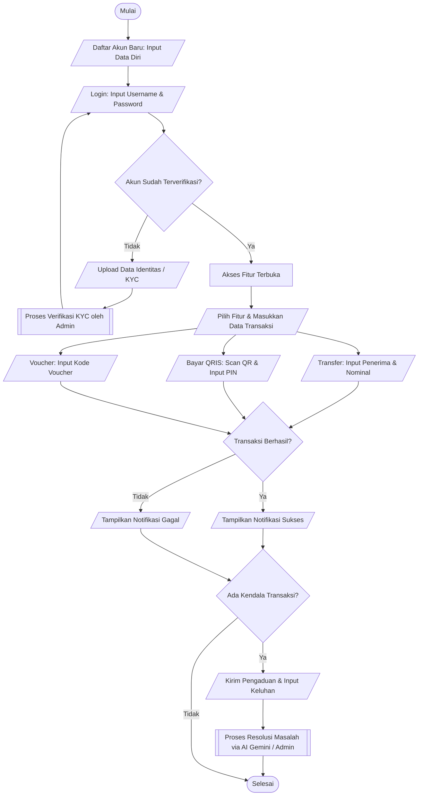
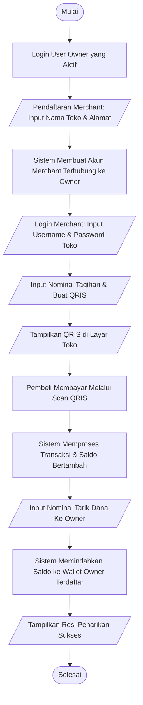
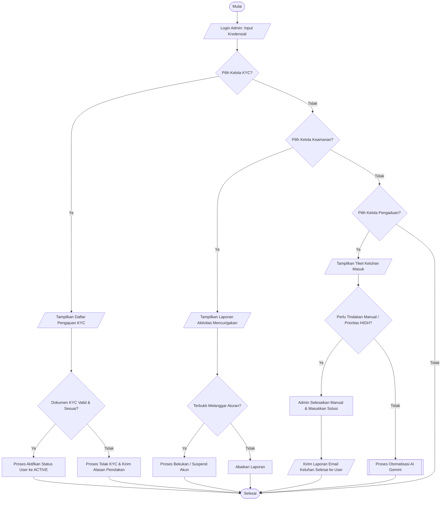

# Alur Kerja Aplikasi E.O.P (Eyes of Priestess) - Edisi Standar Akademik (Koreksi Percabangan)

Semua titik keputusan (**Decision**) dalam diagram di bawah ini telah dikoreksi agar murni bersifat biner (hanya memiliki 2 panah keluar: **Ya / Tidak** atau **True / False**), tanpa ada percabangan menu bernilai banyak (multi-way switch).

---

## 1. Alur Pengguna Biasa (User / Customer)

---

## 2. Alur Pemilik Toko (Merchant)

---

## 3. Alur Pengelola Sistem (Admin)
*Catatan: Pilihan menu kelola pada Admin kini menggunakan urutan keputusan biner (Ya/Tidak) agar sesuai aturan akademik.*

