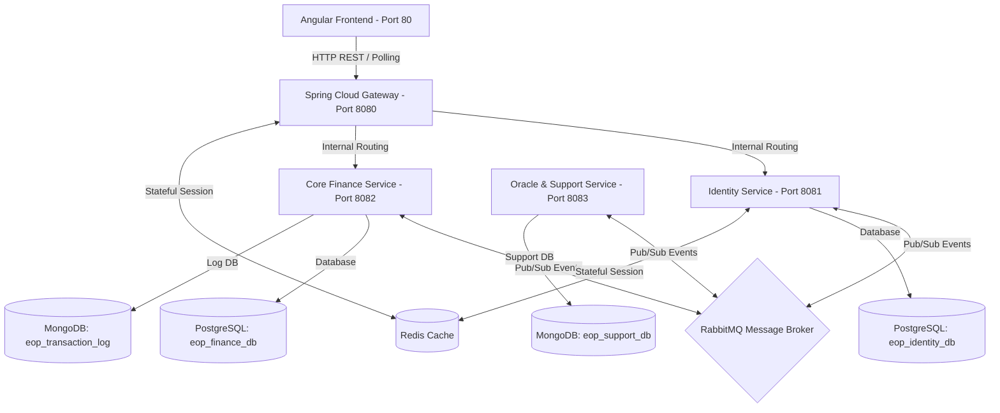

# E.O.P (Eyes Of Priestess) — Stateful Event-Driven E-Wallet System

E.O.P (Eyes of Priestess) adalah sistem inti dompet digital (*E-Wallet*) berbasis arsitektur *Stateful Microservices* dengan pendekatan *Event-Driven Architecture* (EDA). Sistem ini dirancang untuk menangani throughput transaksi yang tinggi, asynchronicity, dan eventual consistency menggunakan Message Broker.

Proyek ini dibangun sebagai bagian dari Ujian Akhir Semester (UAS) mata kuliah **Java Lanjutan** oleh **Richky Rahmadan (TI - Universitas Nasional Pasim)**.

---

## 🏗️ Arsitektur & Topologi Layanan

Sistem E.O.P mengadopsi pemisahan database per service (*Database-per-Service*) tanpa adanya akses database langsung lintas layanan. Komunikasi internal dilakukan secara asinkron menggunakan RabbitMQ.



### 🔌 Distribusi Port & Deskripsi Layanan

1. **E.O.P Gateway (Port `8080`):** Berbasis Spring Cloud Gateway WebMVC. Bertindak sebagai pintu masuk tunggal, manajemen CORS, validasi token JWT stateless, dan verifikasi sesi berbasis Redis.
2. **Identity Service (Port `8081`):** Mengelola autentikasi, registrasi user/merchant, otorisasi berbasis hak akses, serta penerbitan event suspensi user. Database: PostgreSQL (`eop_identity_db`).
3. **Core Finance Service (Port `8082`):** Mengelola saldo berjalan dompet digital, invoice transaksi QRIS, ekspor data transaksi ke Excel, dan sinkronisasi log transaksi. Database: PostgreSQL (`eop_finance_db`) & MongoDB (`eop_transaction_log`).
4. **Support & Oracle Service (Port `8083`):** Mengelola sistem pengaduan tiket bantuan terintegrasi Google Gemini AI API untuk klasifikasi keluhan dan notifikasi email HTML otomatis. Database: MongoDB (`eop_support_db`).
5. **Frontend Application (Port `80`):** Antarmuka pengguna berbasis Angular 18 yang dikemas menggunakan Nginx.

---

## 🛠️ Stack Teknologi

* **Backend Core:** Spring Boot 3.x, Java 21, Spring Security, Spring Cloud Gateway WebMVC.
* **Persistensi Data:** PostgreSQL 16 (Relational DB), MongoDB 7 (NoSQL Document DB).
* **Caching & Session:** Redis 7.
* **Message Broker:** RabbitMQ 3.13 (AMQP).
* **AI Integration:** Google Gemini AI API.
* **Frontend:** Angular 18, TailwindCSS (atau Custom CSS), Nginx.
* **Containerization:** Docker & Docker Compose.

---

## 🚀 Fitur & Mekanisme Utama

* **Stateful Session Tracker (Redis):** Mengamankan session pengguna menggunakan format serialisasi flat-string delimited (`userId:::username:::email...`) di Redis untuk kecepatan tinggi tanpa overhead JSON parsing.
* **Real-time Suspend (Event-Driven):** Saat admin menangguhkan akun, sesi dihapus dari Redis dan event `user.suspended` dikirim via RabbitMQ ke Gateway agar user langsung terblokir seketika.
* **Saga Pattern & Optimistic Locking (Core Finance):** Menghindari inkonsistensi saldo (*double-spending*) melalui Optimistic Locking (`@Version`) dan status transaksi eventual consistency di MongoDB.
* **Analisis Keluhan Berbasis AI (Gemini AI):** Menganalisis prioritas keluhan secara asinkron (`@Async` + `@Retryable`) serta mengirimkan email HTML otomatis jika terdeteksi tiket berprioritas `HIGH`.
* **Export Laporan Excel:** Integrasi Apache POI untuk mengekspor log transaksi keuangan dan keluhan pengguna langsung ke file spreadsheet.

---

## 📦 Panduan Menjalankan Aplikasi Secara Lokal (Docker Compose)

### Prasyarat
* Docker & Docker Compose V2 terpasang di komputer Anda.
* Git.

### Langkah-langkah
1. Clone repository ini ke direktori lokal Anda:
   ```bash
   git clone https://github.com/RichkyRahmadan/UAS_Java_Lanjutan.git
   cd UAS_Java_Lanjutan
   ```

2. Duplikat template konfigurasi environment:
   ```bash
   cp .env.example .env
   ```
   *Buka file `.env` dan masukkan API Key Google Gemini (`GEMINI_API_KEY`) serta kredensial email SMTP Anda.*

3. Bangun dan jalankan seluruh container:
   ```bash
   docker compose up --build -d
   ```

4. Pastikan semua kontainer berjalan lancar:
   ```bash
   docker compose ps
   ```

5. Buka browser dan akses aplikasi melalui:
   * **Frontend Angular:** `http://localhost`
   * **Gateway Endpoint:** `http://localhost:8080`
   * **RabbitMQ Management Dashboard:** `http://localhost:15672` (Username/Password default: `guest`/`guest`)

---

## 📖 Dokumentasi Terkait
Dokumentasi teknis lebih detail dapat ditemukan di folder `Docs/`:
* [Langkah Deployment ke Azure (Docker)](Docs/azure_docker_deployment_guide.md) — Panduan lengkap mendeploy ke Azure VM atau Azure Container Apps.
* [Catatan Progress Milestone](Docs/progress.md) — Riwayat lengkap pembaruan sistem dan perubahan arsitektur.
* [Panduan Desain & Warna](Docs/DESIGN.md) — Detail panduan estetika UI dan CSS.
* [Panduan Setup Manual](Docs/setup.md) — Panduan menjalankan proyek tanpa Docker.
